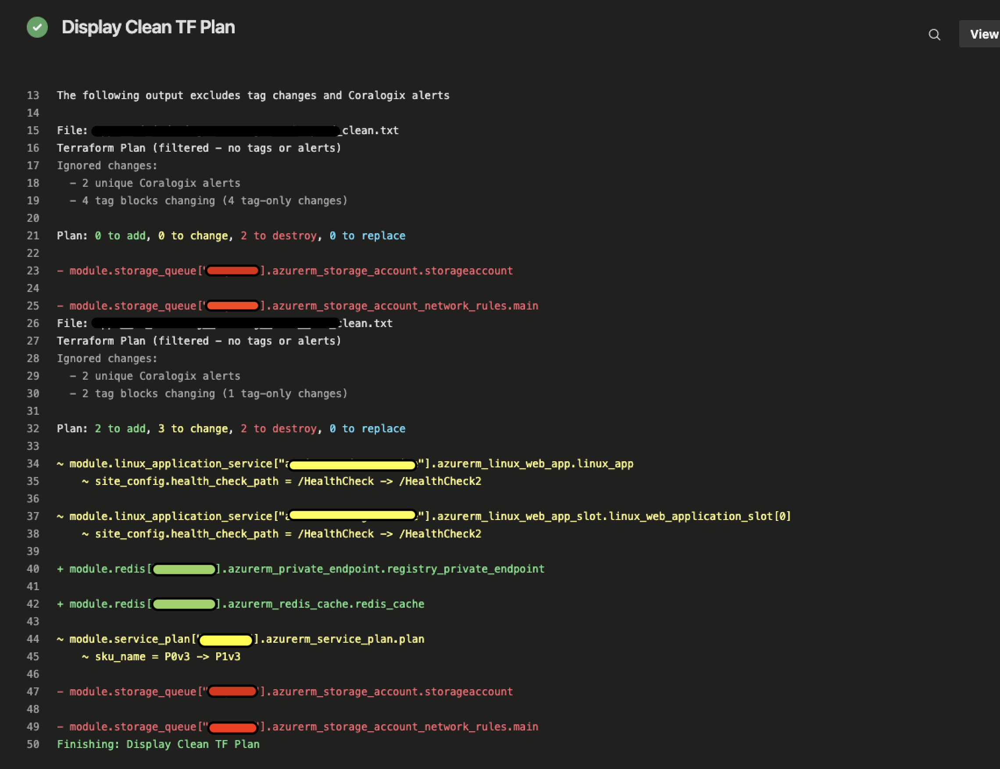
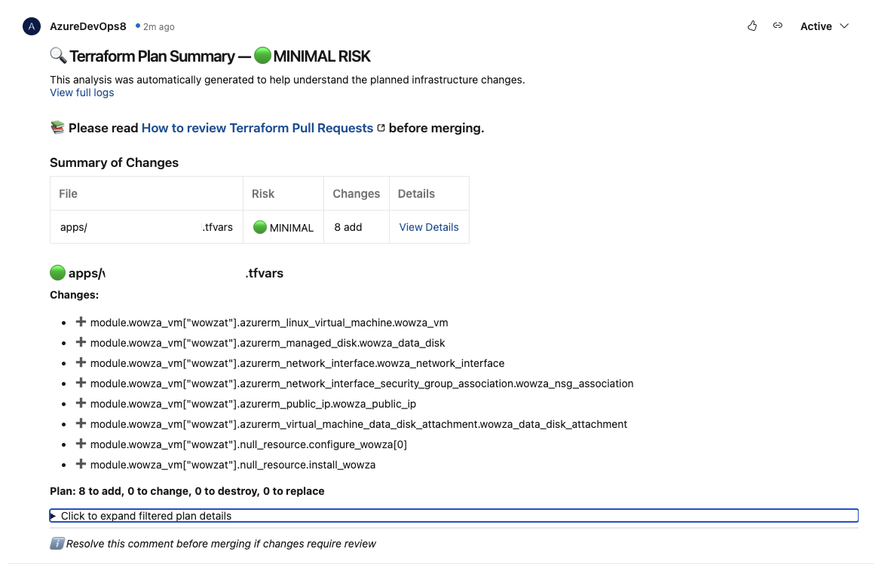

# Terraform-Plan-Simplifier

## Enhanced Overview
Terraform-Plan-Simplifier is a Python-based tool designed to simplify the process of reviewing Terraform plans. It is particularly useful for teams using Azure DevOps, as it integrates seamlessly to provide clear, actionable summaries of infrastructure changes.

## How It Works
1. **Terraform Plan Processing**: The tool processes Terraform plan JSON files, filtering out unnecessary details such as tags and alerts.
2. **Markdown Summaries**: It generates clean, human-readable Markdown summaries of the changes.
3. **Risk Assessment**: The tool evaluates the risk level of the changes based on the number and type of modifications.
4. **Azure DevOps Integration**: Summaries are posted as comments on Azure DevOps pull requests, making it easy for reviewers to understand the impact of the changes.

## Example Workflow
1. A developer makes changes to Terraform files and submits a pull request.
2. The tool runs as part of the CI/CD pipeline, processing the Terraform plan.
3. A summary of the changes, along with a risk assessment, is posted as a comment on the pull request.
4. Reviewers can quickly assess the changes and provide feedback or approval.

## Key Features
- **Customizable**: Environment variables allow you to adapt the tool to your specific setup.
- **Risk Badges**: Visual indicators (e.g., 🟢, 🟡, 🔴) highlight the risk level of changes.
- **Detailed Summaries**: Includes a breakdown of changes by type (add, update, delete, replace).

## Screenshots

### Display Clean TF Plan


### Terraform Plan Summary


## Getting Started
1. Clone the repository:
   ```bash
   git clone <repository-url>
   ```
2. Install dependencies:
   ```bash
   pip install -r requirements.txt
   ```
3. Set up the required environment variables:
   - `ARTIFACT_FOLDER`: Path to store artifacts (default: `default_artifact_folder`).
   - `TF_PATH`: Path to the Terraform files (default: `default_tf_path`).
   - `PROD_ENV`: Comma-separated list of production environments (default: `prod,ytprod,staging,default,openai-prod,openai-nba`).
   - `UAT_ENV`: Comma-separated list of UAT environments (default: `dev,uat,ytuat,openai-uat`).
   - `ROOT_DIRS`: Comma-separated list of root directories (default: `core,apps,shared`).

4. Run the tool to process Terraform plans and generate summaries.

## Contributing
Contributions are welcome! Please submit a pull request or open an issue for any suggestions or improvements.

## License
This project is licensed under the MIT License.